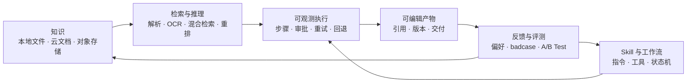

# LazyMind

**[English](README.md)** | **中文**

> **让 AI 按照你的资料、标准和偏好，稳定完成真实任务。**

[](https://github.com/LazyAGI/LazyMind/stargazers)
[](LICENSE)
[](desktop/README.md)
[](desktop/README.md)
[](docs/quick_start.CN.md)

LazyMind 是面向知识密集型工作的 **AI Skill Runtime**：一个把知识、专家方法和工具变成可执行、可恢复任务的运行环境。它在同一个工作台里连接可复用知识、可执行 Skill、可观测工作流、可编辑产物与评测驱动的持续改进。

你不必反复上传资料、调 Prompt 或全程盯着 Agent：选择一次知识与工作流，LazyMind 会继续规划、执行、展示中间结果，并把经过确认的反馈带到下一次任务中。它既可以通过 **Desktop Mode** 在本机使用，也可以部署为团队共享的企业服务，还能为 Codex、Cursor、WorkBuddy 等外部 Agent 提供知识、Skill 与 Workflow 能力。

- **Desktop Mode** 面向具备一定技术基础、但不以编程为主要工作的解决方案、产品、运营、测试和内容从业者，重点降低复杂任务的使用门槛。
- **团队与企业部署** 面向二次开发、项目交付、投标、FDE 和组织知识协作场景，提供权限、共享部署与评测演进能力。

**[快速开始](#快速开始)** · **[产品架构](docs/architecture.md)** · **[构建工作流](docs/workflow-format.md)** · **[桌面模式](desktop/README.md)**

---

## 它能交付什么？

| 场景 | LazyMind 执行 | 你获得 |
|------|---------------|--------|
| **调研与评审** | 搜索资料 → 检索证据 → 对比 → 综合 → 审阅 | 基于内部资料与外部来源、过程可追溯的报告 |
| **AI Writer** | 整理素材 → 生成大纲 → 分章节写作 → 修改 → 终审 | 可编辑、有版本记录的文档，而不是一次性回答 |
| **演示文稿** | 确认需求 → 收集资料 → 生成大纲 → 制作与修改幻灯片 → 导出 | 带演讲稿、可局部调整的 PDF 或 PPTX |
| **AI Image** | 理解需求 → 收集参考 → 优化 Prompt → 生成/编辑 | 保留生成过程的图片与动态表情 |
| **知识助手** | 接入资料 → 解析/OCR → 混合检索 → 重排 → 回答 | 可回溯到组织知识的答案 |
| **外部 Agent 增强** | 连接项目与会话 → 调用知识、Skill 或 Workflow → 跟踪执行 | 在熟悉的 Agent 中继续使用 LazyMind 的能力与产物 |
| **质量改进** | 收集 badcase → 评测 → 诊断 → A/B Test → 部署 | 经过验证的策略优化，而不是未经检查的 Prompt 改动 |


https://github.com/user-attachments/assets/ebc2440e-86f8-4117-a917-62ce4e79a117

> 上方视频展示 LazyMind 从任务输入到可编辑产物的完整执行过程。


## LazyMind 如何工作



这个闭环由三个相互连接的系统组成：

| 系统 | 负责什么 | 产品行为 |
|------|----------|----------|
| **知识底座** | 给 AI 正确的上下文 | 多源接入、OCR、混合检索、重排与原文追溯 |
| **状态大脑** | 让长任务不跑偏 | 步骤可见、关键点审批、产物可编辑、重试/回退与版本记录 |
| **AI 成长引擎** | 安全地改进下一次执行 | 可审核的偏好与术语，以及评测、诊断、A/B Test 与回滚 |

## 核心亮点

### 1. 交付结果，而不只是回复消息

选择知识与 Skill 后，LazyMind 会从资料整理继续推进到规划、生成、审阅与交付。Workflow 用状态机定义步骤、工具、输入输出和流转条件，Artifact 则保留可编辑结果与版本历史。

长任务的每一步都保持可见；用户可以在关键节点审批、直接修改 Artifact，或者从失败步骤重新执行，而不必推倒重来。

<table>
  <tr>
    <td width="50%" align="center">
      <a href="docs/assets/artifact-workspace.jpg"></a>
      <br /><sub>继续执行前，查看并直接编辑 Artifact</sub>
    </td>
    <td width="50%" align="center">
      <a href="docs/assets/artifact-version-diff.jpg"></a>
      <br /><sub>对比版本 Diff，并恢复需要的结果</sub>
    </td>
  </tr>
</table>

### 2. 让每次执行都基于可复用知识

本地目录、对象存储、飞书和 Notion 等数据源进入统一知识库；PDFReader、MinerU 或 PaddleOCR-VL 负责解析文档，再通过多路 Embedding、混合检索和重排，让结果建立在相关证据之上。

<table>
  <tr>
    <td width="50%" align="center">
      <a href="docs/assets/knowledge-library.png"></a>
      <br /><sub>统一管理知识文档，并清晰掌握解析状态</sub>
    </td>
    <td width="50%" align="center">
      <a href="docs/assets/knowledge-cited-answer-latest.png"></a>
      <br /><sub>两个 (1) 分别引用题干和答案，并共同指向下方同一份原始文档</sub>
    </td>
  </tr>
</table>

### 3. 把专家经验封装成可复用工作流

调研方法、写作流程与行业标准可以作为 Skill 管理，并转换为可执行 Workflow。团队可以诊断、修复、发布、版本化和回滚，而不必反复从 Prompt 与脚本重新搭建。开发方式见[工作流格式规范](docs/workflow-format.md)。

<table>
  <tr>
    <td width="50%" align="center">
      <a href="docs/assets/skill-to-workflow-entry.jpg"></a>
      <br /><sub>选择已有 Skill，作为新工作流的起点</sub>
    </td>
    <td width="50%" align="center">
      <a href="docs/assets/skill-to-workflow-editor.png"></a>
      <br /><sub>检查、调整、发布并版本化生成的工作流</sub>
    </td>
  </tr>
</table>

### 4. 从想法到可编辑演示文稿

PPT Workflow 可以把一个演示需求推进到资料收集、大纲确认、幻灯片生成、审核修改和最终导出。它能够使用用户输入、上传文件、LazyMind 知识库、Web 搜索结果和 AI 配图作为素材，并为每一页生成对应演讲稿。

生成后可以拖拽调整页面顺序、批量移动或删除页面，也可以选中页面中的文字或元素，用自然语言修改内容与局部样式。最终成果支持 PDF、图片版 PPTX，以及包含文字、图形、图片和图表的可编辑 PPTX。

> **图片占位：PPT Workflow 全流程截图。** 建议使用一张 16:9 横图，同时展示左侧执行步骤、中间幻灯片预览和右侧大纲/素材区域；画面中应能看到“资料收集 → 大纲 → 生成 → 审核 → 导出”的阶段，以及一个可编辑的实际页面。

### 5. 从能力中心发现开箱即用的场景

能力中心把快速问答、复杂任务和精选案例组织在统一入口中。用户可以按场景、能力类型和技术标签筛选，查看能力介绍、工作流程、示例输入与交互式结果，再通过“试一试”进入对应 Chat 或 Work。精选能力与真实可运行的 Skill 绑定，并在首次使用时按需安装。

> **图片占位：能力中心首页截图。** 建议展示分类筛选、至少 6 个精选能力卡片和一个带实际结果预览的能力详情；需要让读者看出这些不是静态案例，而是可以直接“试一试”的可运行能力。

### 6. 在文档中直接阅读、追问和修改

知识库文档预览页支持围绕当前文档进行对话，并可引用 PDF 选区、知识切片或切片中的部分内容。临时会话不会污染普通聊天历史，也可以在需要时转为正式会话继续保存。

聊天回答和 Writer 文稿中的选区可以交给 AI 做最小范围修改，并通过 Diff 查看变化、接受或拒绝结果。引用保留来源信息，便于从回答回到原始文档。

> **图片占位：文档对话与局部修改组合图。** 建议左右两张：左侧为 PDF 选区进入当前文档对话并显示引用；右侧为选中文字后的 AI 修改 Diff，包含“接受”和“拒绝”操作。

### 7. 让外部 Agent 使用同一套知识与能力

LazyMind 可以发现 Codex、Cursor、WorkBuddy、TRAE Work、DeepSeek Harness 等外部 Agent 的本地项目和历史任务，并在统一工作台中创建、继续和查看执行过程。外部 Agent 还可以通过 MCP 使用 LazyMind 的 Workflow、Skills、知识库和云文档，而无需重复搭建任务材料。

> **图片占位：外部 Agent 协作截图。** 建议展示一个 Codex 或 Cursor 任务在 LazyMind 中被发现并继续执行，画面同时包含项目/会话选择、执行状态、工具步骤和最终产物；避免只截设置页的连接开关。

### 8. 只在证据支持时改进系统

“智积阅累”负责沉淀用户想要什么——偏好、术语、经验与 Skill；`evo` 负责验证系统怎样做得更好——把 badcase 变成评测样例，依次执行基线评测、问题诊断、修复与 A/B Test。

<table>
  <tr>
    <td width="50%" align="center">
      <a href="docs/assets/skill-review.png"></a>
      <br /><sub>智积阅累：复盘 Skill，沉淀偏好、术语与经验</sub>
    </td>
    <td width="50%" align="center">
      <a href="docs/assets/evo-pipeline.png"></a>
      <br /><sub>算法跃迁：经过评测验证，再安全发布改进</sub>
    </td>
  </tr>
</table>

### 9. 从本地开始，在需要协作时扩展

Desktop Mode 使用原生进程、SQLite 和 Milvus Lite，并遵循平台规范管理数据目录；团队部署可以进一步接入 Kong、JWT/RBAC、Core ACL、外部 Milvus/OpenSearch 与私有化 OCR。两种模式保持一致的工作方式。

---

## 快速开始

### 本机运行

前置条件：Go、Python 3、uv、pnpm 和 Node.js。

```bash
make local-up
```

Windows PowerShell 使用：

```powershell
make local-win-up
```

启动后访问：

- LazyMind：http://localhost:8090
- API 文档：http://localhost:8090/docs.html
- 默认账号：`admin` / `admin`

登录后进入前端的**设置**页面：

- 在**模型供应商**中添加供应商凭证与 API Key，再到**系统默认设置**中选择默认的大模型、向量模型和重排序模型；多模态向量、图文、语音、图片、视频和自进化模型均可按需配置。
- 在**工具**中按需配置服务凭证，包括用于文档解析的 MinerU 或 PaddleOCR、网页与学术搜索引擎，以及其他集成。使用 MinerU 在线服务时，无需再通过环境变量配置 API Key。

<table>
  <tr>
    <td width="50%" align="center">
      <a href="docs/assets/settings-models.png"></a>
      <br /><sub>为不同系统能力选择默认模型</sub>
    </td>
    <td width="50%" align="center">
      <a href="docs/assets/settings-tools.png"></a>
      <br /><sub>配置文档解析、搜索与其他工具凭证</sub>
    </td>
  </tr>
</table>

停止本地运行：

```bash
make local-down
```

Windows 使用 `make local-win-down`。完整配置见 [快速开始](docs/quick_start.CN.md)。

### 构建桌面应用

Mac 本地打包并上传 RAG 依赖，请按 [Mac 构建、上传与安装验证流程](desktop/INSTALL.zh-CN.md) 操作。文档包含构建环境、原始组件 ZIP 的位置、ModelScope 上传及安装后测试步骤。

| 平台 | 命令 | 产物 |
|------|------|------|
| macOS arm64 | `make desktop-darwin-arm64` | macOS 桌面应用 |
| Windows x64 | `make desktop-windows-x64` | 便携 ZIP |
| Windows x64 | `make desktop-windows-x64-installer` | 安装程序 |

### 容器部署

```bash
make up
```

该命令会同时启动 Docker 服务和本机「助理桥接器」。打开“设置 → 助理”即可一键连接 Codex、Cursor、WorkBuddy、TRAE Work 或 DeepSeek Harness，无需再运行 MCP 配置命令；只安装 Docker、未安装 Go 时，桥接器会由 Docker 自动交叉编译为当前宿主机版本。

Windows 请在已安装 `make` 的 Git Bash 中执行该命令，不要改用裸 `docker compose up`：容器无法检测或启动 Windows 主机中安装的程序。macOS 和 Windows 都会通过宿主机桥接器自动发现 CLI 与桌面应用；若程序位于自定义或便携目录，可在“设置 → 助理”中定位程序或输入完整宿主机路径。

### 启动命令速查

| 场景 | 命令 |
|------|------|
| 构建镜像并启动 | `make up-build` |
| 私有化 MinerU OCR | `make up LAZYMIND_DEPLOY_MINERU=1` |
| 私有化 PaddleOCR | `make up LAZYMIND_DEPLOY_PADDLEOCR=1` |
| 外接 Milvus/OpenSearch | `make up LAZYMIND_MILVUS_URI=http://your-milvus:19530 LAZYMIND_OPENSEARCH_URI=https://your-opensearch:9200` |

Docker/Colima 配置见 [Colima 配置说明](docs/quick_start.CN.md#macos使用-colima-替代-docker-desktop)或完整的[快速开始](docs/quick_start.CN.md)，服务依赖、环境变量和鉴权链路见[架构文档](docs/architecture.md)。

---

## 当前已具备的能力

| 领域 | 当前能力 |
|------|----------|
| 知识库 | 多数据源、OCR、向量化、混合检索、重排、同步管理 |
| Agent | RAG 对话、工具调用、子任务时间轴、Artifact、任务中心、长对话压缩 |
| 内容创作 | AI Writer、PPT Workflow、AI Image、局部修改与多格式导出 |
| Workflow | 状态机、动态路由、自动验收、重试/回退、可视化执行、版本化产物 |
| Skill | 安装、组织、审核、版本、回滚、Skill → Workflow |
| 能力中心 | 精选 Skills、场景分类、交互式 Demo、按需安装 |
| 文档阅读 | 当前文档问答、PDF 选区引用、来源回跳、临时会话 |
| 外部 Agent | 本地项目与会话发现、任务继续执行、MCP 知识与能力接入 |
| 任务与会话 | 终止状态、归档、回收站、恢复、任务与会话状态同步 |
| 自进化 | 评测集、评测、badcase 分析、修复、部署、A/B Test |
| 本地体验 | macOS/Windows 本地运行时、Desktop 构建、平台规范数据目录 |
| 企业能力 | Kong、JWT/RBAC、ACL、OAuth 数据源、可选外部存储 |

这份列表描述的是仓库中已经实现的能力，不是未来 Roadmap。具体模块的设计与实现状态见 [docs](docs/)。

---

## Roadmap

LazyMind 接下来的重点不是继续堆叠孤立功能，而是强化 Skill Runtime，让知识、Skill、Workflow 和自进化能力在 LazyMind 与其他 Agent 中共同形成完整任务闭环。

### 近期：完善 0.4 核心能力

**Skill Runtime 与 Desktop**

- **热门 Skill 兼容与评测**：建立可安装性、安全性、核心流程和效果评测，让经过验证的热门 Skill 可以直接安装并稳定运行，失败时给出明确原因。
- **精选 Skill 规模化**：围绕典型行业与任务扩充官方精选 Skill 和可复现 Demo，并将质量验证结果作为推荐依据。
- **Skill → Workflow 体验**：增加转换前预检、进度与失败诊断、任务恢复和原 Skill 关联；执行时由用户选择使用 Skill 还是关联 Workflow。
- **Skill 与 Tool 按需检索**：任务开始时只召回相关能力，命中后再加载完整定义，降低上下文和 Token 消耗。
- **可信本地工作区**：在 Desktop Work 模式中选择和授权本地文件夹，允许在明确边界内读写文件，并支持查看和撤销授权。
- **浏览器内容感知**：通过 Chrome 插件在用户授权后读取当前页面的标题、正文、链接和基础元数据，为复杂任务补充浏览器上下文。
- **首次使用与任务预检**：围绕非开发者优化模型配置、依赖检查、权限提示、失败恢复和本地运行时诊断。

**外部 Agent 生态**

- **完整 Workflow 调用**：让 Codex、Cursor、WorkBuddy、TRAE Work、DeepSeek Harness 等提交 Skill 与任务，获取执行状态、结果文件和 LazyMind 任务链接。
- **统一文档访问**：让外部 Agent 在现有授权边界内使用本地文件、飞书、Notion 和 Google Drive，并获得统一的内容与来源信息。
- **模型与工具共享**：由 LazyMind 代理调用用户授权的模型和工具，实现一次配置、多 Agent 使用，同时不暴露原始 API Key。
- **权限与审计**：统一管理外部 Agent 的能力授权、调用状态、用量和执行记录。

**任务与资源基础设施**

- **统一 File Resource**：覆盖附件、知识库、网络结果、MCP Resource 和各类 Artifact，并对大体积内容按需读取。
- **会话组织**：支持会话 Fork、对话组和子对话保留，让复杂任务的探索分支可整理、可继续。
- **产物交付**：统一任务产物的发现、预览与下载，让文档、表格、图片、代码和压缩包都有明确的交付状态与入口。
- **偏好整理**：自动合并重复或冲突偏好、清理低价值记录，让重要偏好持续进入任务上下文。

### 中期：打通知识、创作与分发闭环

**知识源、编辑与发布**

- **长文本知识源**：接入 Obsidian、GitHub Docs/Wiki、语雀，并完善 Notion 的同步、附件与写回能力。
- **统一内容格式**：完善 Markdown、Writer IR 与平台富文本的双向转换，预览格式降级并避免静默丢失图片、代码或正文。
- **结果交付**：增强 DOCX 等高保真导出、可分享结果页，以及飞书、Notion 和微信公众号草稿箱等发布目标。
- **多渠道通知与邮件**：让定时任务通过飞书、企业微信、微信等渠道交付结果，并支持邮件读取、任务协助和草稿生成。
- **场景包与团队治理**：将 Workflow、Skill、知识包、审阅规则和输出格式组合为可安装方案，补充依赖、安全、版本和组织权限治理。

**旗舰场景：证据驱动的论文研究与技术写作**

- 在 PDF 中完成选区翻译、解释、深入提问、生词收集和证据保存，并始终可以回到原文。
- 从当前论文扩展到相关论文搜索、导入、多论文对比和文献综述，明确区分全文、摘要与模型推断。
- 在论文与最终文稿之间建立 Evidence，按章节绑定证据、分段写作并检查关键论断是否得到来源支持。
- 复用 AI Writer 完成材料分析、大纲、分章节草稿、局部补证据、引用核验和带参考论文列表的导出。

> **图片占位：论文阅读到技术攻略的产品闭环图。** 建议采用横向流程图或四联屏，依次展示 PDF 选区阅读、论文 Evidence 列表、多论文对比、AI Writer 引用写作；每一步都应显示来源或原文回跳能力。

### 长期：从执行工作流走向自进化工作系统

- 根据用户修改、步骤重跑、知识引用和最终采纳结果，自动发现流程与知识缺口。
- 对检索策略、Prompt、模型、工具和 Workflow 版本进行持续评测与 A/B Test。
- 将成功经验沉淀为可复用的 Skill、模板和组织记忆，并保留完整来源与版本记录。
- 通过“横向任务模板 + 纵向行业知识包 + 可安装场景包”覆盖更多行业，而不是为每个行业重复开发产品。

Roadmap 会根据真实场景的完成率、结果质量、人工干预次数、执行时间和成本持续调整；具体版本内容以仓库 Issue、里程碑和发布说明为准。

---

## 项目结构

```text
LazyMind/
├── frontend/                   # Web UI 与桌面前端
├── backend/
│   ├── auth-service/           # 鉴权、OAuth 与用户服务
│   ├── core/                   # 数据、任务、检索、Workflow 与 ACL
│   └── scan-control-plane/     # 数据源扫描与同步控制
├── algorithm/
│   └── lazymind/               # 对话、解析、检索与 Agent 运行时
├── workflows/                    # 内置 Workflow
├── skills/                     # 内置及精选 Skill
├── evo/                        # 自进化与评测闭环
├── desktop/                    # Electron 桌面应用与打包
├── local/                      # 本地运行时管理
├── api/                        # OpenAPI 规范
├── docs/                       # 架构、使用与设计文档
└── tests/                      # 跨服务测试
```

---

## 开发与测试

```bash
make lint              # Python + Go + 文档等静态检查
make lint-only-diff    # 只检查变更文件
make test              # 使用宿主机环境运行测试
make test-hermetic     # 使用项目管理的隔离环境运行同范围测试
```

- Python 3.11+
- Go 1.24.0
- Node.js 20
- OpenAPI 规范集中维护在 `api/`

---

## License

见 [LICENSE](LICENSE)。
